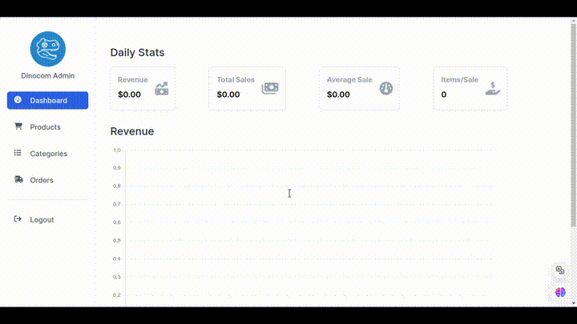
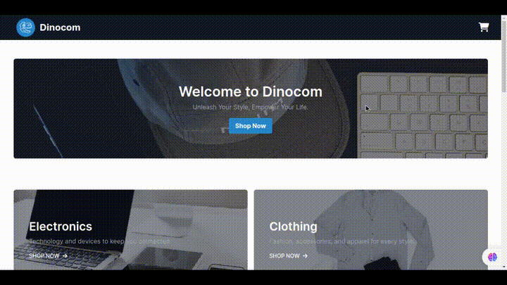

# Dinocom Ecommerce

This project is a Ruby on Rails ecommerce application. The application features two distinct sections: an admin panel and a user section.

## Technologies Used

- **Ruby on Rails**: Web application framework used to build the application.
- **PostgreSQL**: Database management system used for storing and managing data.
- **AWS S3**: Amazon Web Services' Simple Storage Service used for managing and storing images.
- **Devise**: Authentication solution for managing admin user sessions and registrations.
- **Mercado Pago**: Payment gateway integration for simulating transactions.

## Admin Panel

Administrators can manage users with full authentication, admins have the ability to create, read, update, and delete categories, products, and orders the panel have a comprehensive dashboard provides an overview of key metrics and operations.

## User Section

The user section is designed for simulating shopping, users can view available products and explore categories, the application integrates with Mercado Pago for payment processing, allowing users to simulate purchases

## Project's Link

[dinocom.onrender.com](https://dinocom-k18j.onrender.com/)

(It may sometimes be slow due to Render's free tier.)
